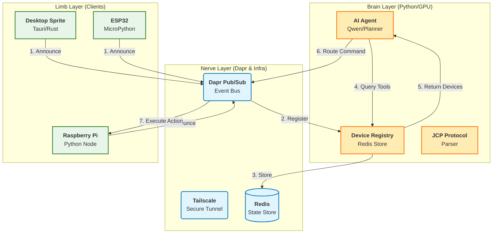
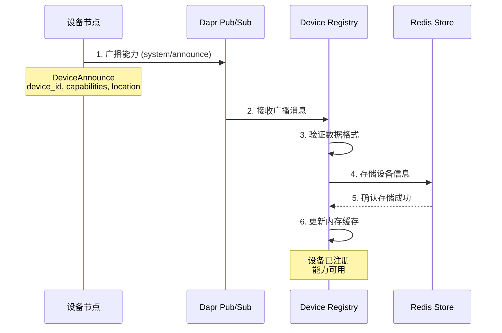
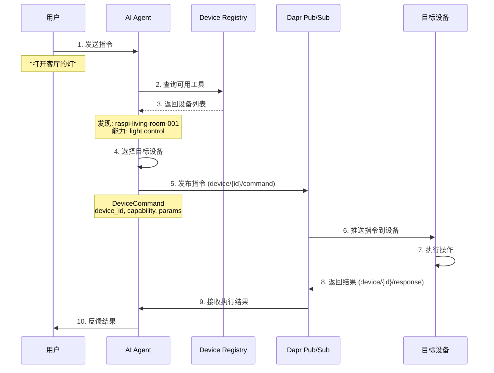
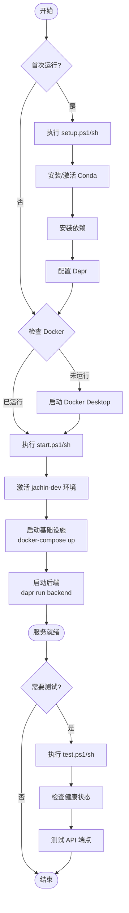

# Scripts 使用指南

## 系统架构图

### Jachin-System v2.0 三层架构



### 组件说明

- **Brain Layer（大脑层）**: AI 推理、设备管理、协议解析
- **Nerve Layer（神经层）**: 消息总线、状态存储、安全隧道
- **Limb Layer（肢体层）**: 各种客户端和设备节点

## 核心流程

### 能力发现流程



### 指令执行流程



### 脚本执行流程



## 核心脚本（简化版）

### Windows (PowerShell)

| 脚本 | 功能 | 使用 |
|------|------|------|
| `setup.ps1` | 初始设置（Conda、依赖、Dapr） | `.\scripts\setup.ps1` |
| `start.ps1` | 启动所有服务（自动激活环境） | `.\scripts\start.ps1` |
| `stop.ps1` | 停止所有服务 | `.\scripts\stop.ps1` |
| `restart.ps1` | 重启所有服务（自动激活环境） | `.\scripts\restart.ps1` |
| `test.ps1` | 测试 API | `.\scripts\test.ps1` |

### Linux/macOS (Bash)

| 脚本 | 功能 | 使用 |
|------|------|------|
| `setup.sh` | 初始设置 | `chmod +x scripts/setup.sh`<br>`./scripts/setup.sh` |
| `start.sh` | 启动所有服务（自动激活环境） | `./scripts/start.sh` |
| `stop.sh` | 停止所有服务 | `./scripts/stop.sh` |
| `restart.sh` | 重启所有服务（自动激活环境） | `./scripts/restart.sh` |
| `test.sh` | 测试 API | `./scripts/test.sh` |

## 快速开始

### Windows

```powershell
# 1. 首次设置
.\scripts\setup.ps1

# 2. 启动服务（自动激活环境，无需手动激活）
.\scripts\start.ps1

# 3. 测试（在另一个终端）
.\scripts\test.ps1
```

### Linux/macOS

```bash
# 1. 首次设置
chmod +x scripts/*.sh
./scripts/setup.sh

# 2. 启动服务（自动激活环境，无需手动激活）
./scripts/start.sh

# 3. 测试（在另一个终端）
./scripts/test.sh
```

## 注意事项

- **脚本会自动激活 jachin-dev 环境**，无需手动激活
- 确保 Docker Desktop/Docker 正在运行
- 确保已配置 API Key（`.env` 文件中的 `QWEN_API_KEY`）
- 首次运行需要运行 `setup` 脚本
